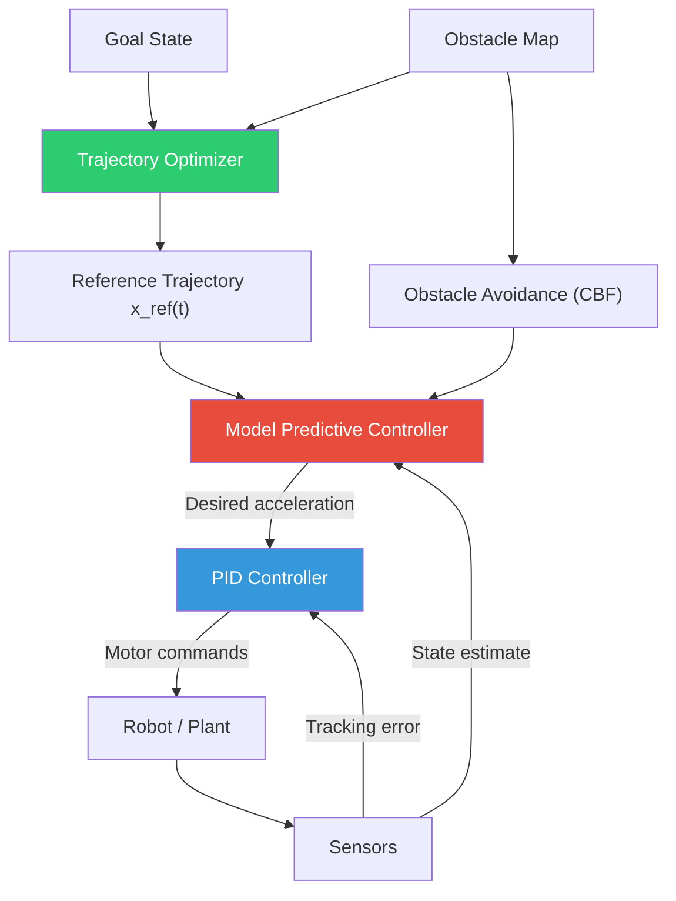
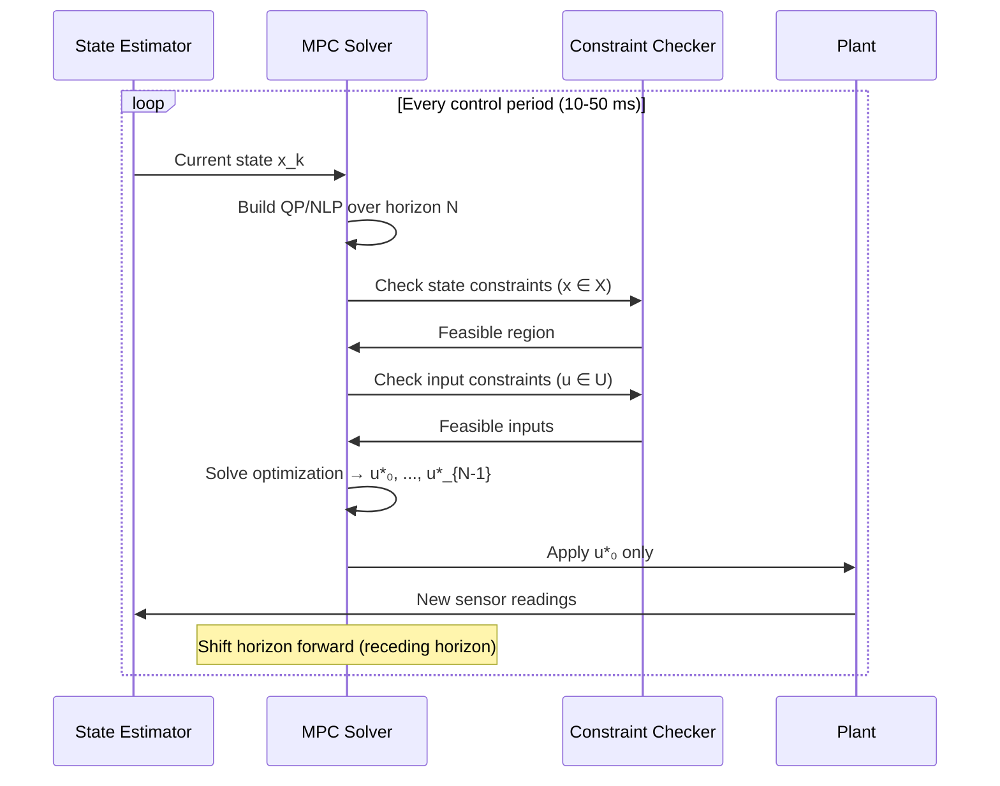
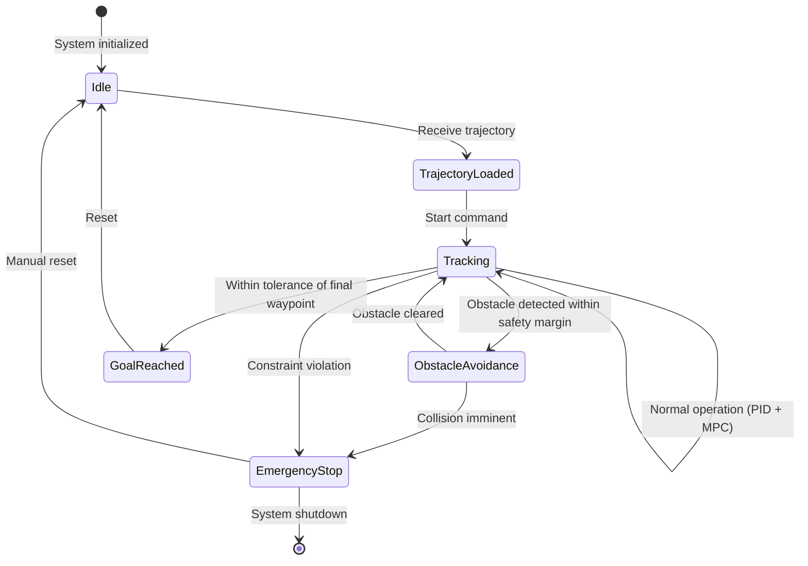

# Motion Planning & Control

A from-scratch implementation of classical and modern control systems: PID controllers with anti-windup, Model Predictive Control (MPC) for constrained optimization, trajectory generation with minimum-jerk and spline interpolation, and obstacle avoidance using control barrier functions. Demonstrates how to make a robot follow a desired path smoothly, safely, and in real time.

## Theory & Background

### From Planning to Execution

Path planning (finding where to go) is only half the problem. The other half is control — making the robot actually follow that path despite disturbances, model errors, and physical constraints. A planned trajectory is a sequence of desired states over time. The controller's job is to compute the forces and torques that keep the robot on that trajectory, reacting to errors in real time.

The control hierarchy typically has three layers: trajectory optimization generates a reference path, MPC plans the next few seconds of motion respecting constraints, and PID handles the low-level tracking at millisecond timescales. Each layer operates at a different frequency and abstraction level.

### PID Control: The Workhorse

PID (Proportional-Integral-Derivative) control is the most widely deployed control algorithm in the world — found in everything from thermostats to rocket engines. It computes a control signal from three terms based on the tracking error $e(t) = r(t) - y(t)$, where $r(t)$ is the reference and $y(t)$ is the measured output:

```math
u(t) = K_p e(t) + K_i \int_0^t e(\tau) \, d\tau + K_d \frac{de(t)}{dt}
```

Each term serves a distinct purpose:
- **Proportional** ($K_p e$): Reacts to the current error. Higher $K_p$ means faster response but can cause oscillation.
- **Integral** ($K_i \int e$): Eliminates steady-state error by accumulating past errors. Too much causes overshoot and windup.
- **Derivative** ($K_d \dot{e}$): Damps oscillations by reacting to the rate of change. Sensitive to noise.

In discrete time (which is how controllers actually run), the PID update at timestep $k$ with sample period $T_s$ is:

```math
u_k = K_p e_k + K_i T_s \sum_{j=0}^{k} e_j + K_d \frac{e_k - e_{k-1}}{T_s}
```

**Anti-windup** is critical for real systems. When the actuator saturates (e.g., a motor at maximum torque), the integral term keeps growing even though the output can't increase. This causes massive overshoot when the error finally reverses. The implementation uses back-calculation anti-windup:

```math
\text{integral}_{k+1} = \text{integral}_k + K_i e_k T_s + \frac{1}{T_t}(u_{\text{sat}} - u_{\text{raw}}) T_s
```

where $T_t$ is the tracking time constant and $u_{\text{sat}}$ is the saturated output.

### Model Predictive Control: Planning Ahead

MPC solves an optimization problem at every timestep, planning the next $N$ control actions while respecting constraints on states and inputs. It's the only mainstream control method that handles constraints explicitly — making it essential for safety-critical systems.

At each timestep, MPC solves:

```math
\min_{u_0, \ldots, u_{N-1}} \sum_{k=0}^{N-1} \left[ (x_k - x_{\text{ref}})^\top Q (x_k - x_{\text{ref}}) + u_k^\top R \, u_k \right] + (x_N - x_{\text{ref}})^\top Q_f (x_N - x_{\text{ref}})
```

subject to the dynamics and constraints:

```math
x_{k+1} = f(x_k, u_k), \quad x_k \in \mathcal{X}, \quad u_k \in \mathcal{U}, \quad k = 0, \ldots, N-1
```

where $Q$ penalizes state deviation, $R$ penalizes control effort, $Q_f$ is the terminal cost, $\mathcal{X}$ is the state constraint set, and $\mathcal{U}$ is the input constraint set.

Only the first control action $u_0^*$ is applied, then the optimization is re-solved at the next timestep with updated state — this is the **receding horizon** principle. It provides feedback by continuously replanning.

**Linear MPC** (when $f$ is linear) reduces to a quadratic program (QP) solvable in milliseconds. **Nonlinear MPC** requires solving a nonlinear program (NLP) at each step, which is more expensive but handles complex dynamics like vehicle kinematics.

### Trajectory Optimization

A trajectory is more than a path — it specifies the desired state at every point in time. Good trajectories are smooth (minimizing jerk or snap), respect dynamic limits, and avoid obstacles.

**Minimum-jerk trajectory**: Minimizes the integral of squared jerk (derivative of acceleration), producing the smoothest possible motion. For a 1D trajectory from $x_0$ to $x_f$ in time $T$:

```math
\min_{x(t)} \int_0^T \left(\frac{d^3 x}{dt^3}\right)^2 dt
```

The solution is a 5th-order polynomial:

```math
x(t) = a_0 + a_1 t + a_2 t^2 + a_3 t^3 + a_4 t^4 + a_5 t^5
```

with coefficients determined by boundary conditions on position, velocity, and acceleration at $t = 0$ and $t = T$.

**Cubic spline trajectories** pass through a sequence of waypoints with continuous first and second derivatives, providing $C^2$ smoothness. For $n$ waypoints, the spline has $n - 1$ segments, each a cubic polynomial, with $4(n-1)$ unknowns determined by interpolation conditions, continuity constraints, and boundary conditions.

### Control System Architecture



### MPC Optimization Cycle



### Controller State Machine



### Control Pipeline Timeline

```mermaid
gantt
    title Real-Time Control Pipeline (per cycle)
    dateFormat X
    axisFormat %s ms

    section Sensing
        Read encoders + IMU        :0, 1
        State estimation (EKF)     :1, 2

    section Planning
        Trajectory lookup          :2, 3
        MPC optimization (QP)      :3, 6
        Obstacle check (CBF)       :6, 7

    section Actuation
        PID inner loop             :7, 8
        Motor command output       :8, 9
        DAC / PWM write            :9, 10
```



### Tradeoffs and Alternatives

| Aspect | This Implementation | Alternative | Tradeoff |
|--------|-------------------|-------------|----------|
| **Low-level control** | PID with anti-windup | LQR (Linear Quadratic Regulator) | PID is simple and tunable without a model; LQR is optimal for linear systems but requires an accurate state-space model |
| **Predictive control** | Linear + Nonlinear MPC | iLQR (iterative LQR) | MPC handles constraints explicitly; iLQR is faster for unconstrained problems and scales better to high dimensions |
| **Trajectory generation** | Minimum-jerk polynomials | B-splines, Bézier curves | Polynomials have closed-form solutions; splines offer more local control and easier waypoint insertion |
| **Obstacle avoidance** | Control Barrier Functions | Velocity obstacles, APF | CBFs provide formal safety guarantees; velocity obstacles are simpler but lack guarantees for nonlinear systems |
| **Solver** | CVXPY (QP) + CasADi (NLP) | OSQP, IPOPT directly | CVXPY is more readable; direct solvers are faster for real-time applications with tight timing budgets |

### Key References

- Åström & Murray, "Feedback Systems: An Introduction for Scientists and Engineers" (2008) — [Caltech](https://www.cds.caltech.edu/~murray/amwiki/)
- Rawlings, Mayne & Diehl, "Model Predictive Control: Theory, Computation, and Design" (2017) — [Nob Hill](https://sites.engineering.ucsb.edu/~jbraw/mpc/)
- Ames et al., "Control Barrier Functions: Theory and Applications" (2019) — [arXiv](https://arxiv.org/abs/1903.11199)
- LaValle, "Planning Algorithms" (2006) — [Cambridge](http://lavalle.pl/planning/)
- Flash & Hogan, "The Coordination of Arm Movements: An Experimentally Confirmed Mathematical Model" (1985) — [JNeuro](https://doi.org/10.1523/JNEUROSCI.05-07-01688.1985)

## Real-World Applications

Motion planning and control are what turn a robot's intent into physical action. These algorithms determine how smoothly a robotic arm welds a car frame, how safely a drone delivers a package, and how precisely a surgical robot makes an incision. The gap between a planned path and a well-controlled trajectory is the difference between a prototype and a product.

| Industry | Use Case | Impact |
|----------|----------|--------|
| **Industrial robotics** | Multi-axis robot arm control for welding, painting, and assembly with MPC for constraint-aware motion in tight workspaces | Increases throughput by 30-50% over teach-pendant programming while maintaining sub-millimeter precision |
| **Autonomous vehicles** | Lateral and longitudinal control for lane keeping, lane changes, and intersection navigation with real-time obstacle avoidance | Enables smooth, comfortable driving that meets safety standards (ISO 26262) with reaction times under 100ms |
| **Drone delivery** | Trajectory optimization for energy-efficient flight paths with wind disturbance rejection and dynamic obstacle avoidance | Extends delivery range by 15-25% through optimal trajectory planning and reduces crash rates in urban environments |
| **Surgical robotics** | Tremor-filtered, force-limited control for minimally invasive surgery with sub-millimeter accuracy requirements | Enables procedures impossible by hand (e.g., retinal surgery) and reduces patient recovery time by 40-60% |
| **CNC machining** | Toolpath control with jerk-limited trajectories for smooth surface finishes and minimal tool wear | Reduces machining time by 20-30% while improving surface quality from optimized feed rate profiles |

## Project Structure

```
motion-planning-control/
├── src/
│   ├── __init__.py
│   ├── pid/
│   │   ├── __init__.py
│   │   ├── controller.py          # PID with anti-windup and derivative filtering
│   │   ├── tuning.py              # Ziegler-Nichols and relay auto-tuning
│   │   └── cascade.py             # Cascaded PID (position → velocity → torque)
│   ├── mpc/
│   │   ├── __init__.py
│   │   ├── linear_mpc.py          # Linear MPC via QP (CVXPY)
│   │   ├── nonlinear_mpc.py       # Nonlinear MPC via NLP (CasADi)
│   │   └── models.py              # Dynamic models (unicycle, bicycle, quadrotor)
│   ├── trajectory/
│   │   ├── __init__.py
│   │   ├── min_jerk.py            # Minimum-jerk polynomial trajectories
│   │   ├── splines.py             # Cubic and quintic spline interpolation
│   │   └── time_optimal.py        # Time-optimal trajectory with velocity limits
│   └── obstacles/
│       ├── __init__.py
│       ├── cbf.py                 # Control Barrier Functions for safety
│       ├── potential_field.py     # Artificial potential field avoidance
│       └── collision.py           # Geometric collision checking (circles, polygons)
├── requirements.txt
├── .gitignore
└── README.md
```

## Quick Start

```bash
pip install -r requirements.txt

# PID control of a second-order system with step response
python -m src.pid.controller --kp 2.0 --ki 0.5 --kd 0.1 --setpoint 1.0

# Auto-tune PID gains using Ziegler-Nichols method
python -m src.pid.tuning --plant "1/(s^2 + 2s + 1)" --method ziegler-nichols

# Run linear MPC on a double integrator with constraints
python -m src.mpc.linear_mpc --horizon 20 --x-max 5.0 --u-max 1.0

# Generate minimum-jerk trajectory through waypoints
python -m src.trajectory.min_jerk --waypoints "0,0;5,3;10,0" --duration 5.0

# Simulate obstacle avoidance with control barrier functions
python -m src.obstacles.cbf --obstacles "5,5,1.0;8,3,0.5" --goal 10,10
```

## Implementation Details

### What makes this non-trivial

- **Anti-windup with back-calculation**: Naive integral windup causes dangerous overshoot in actuator-limited systems. The implementation tracks the difference between the unsaturated and saturated control signal and feeds it back to the integrator with a configurable tracking time constant, providing smooth recovery from saturation without manual reset.
- **Warm-starting MPC**: Solving the QP/NLP from scratch every cycle is wasteful. The implementation shifts the previous solution forward by one timestep and uses it as the initial guess, reducing solve time by 50-80% and improving real-time feasibility.
- **Nonlinear MPC with CasADi**: For systems with nonlinear dynamics (e.g., bicycle model for vehicles), the implementation formulates the NLP using CasADi's symbolic framework and solves it with IPOPT. The dynamics are discretized using 4th-order Runge-Kutta collocation for accuracy.
- **Control Barrier Functions**: CBFs provide a formal safety guarantee — the system provably never enters unsafe states. The implementation modifies the MPC cost function with a CBF constraint $\dot{h}(x, u) + \alpha(h(x)) \geq 0$, where $h(x) > 0$ defines the safe set. This is more principled than potential fields, which can have local minima.
- **Cascaded PID architecture**: Real robotic systems use nested PID loops — an outer position loop commands a velocity setpoint, which commands a torque setpoint. The implementation handles the different loop rates (position at 100 Hz, velocity at 1 kHz, torque at 10 kHz) with proper inter-loop synchronization.
